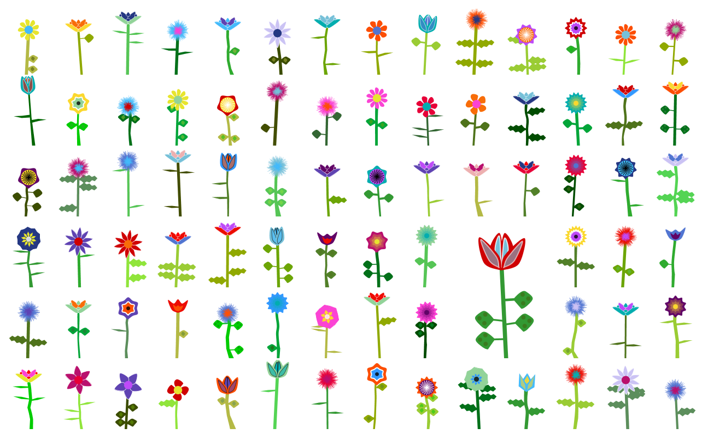
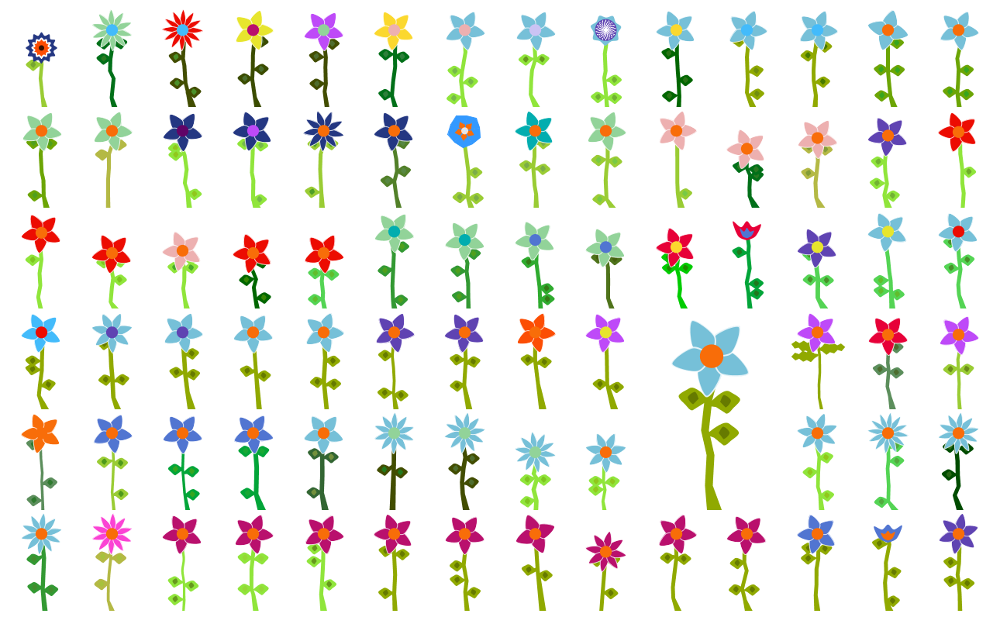
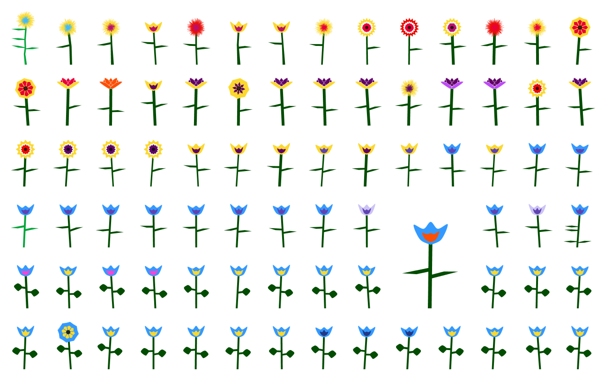

**Update 2021-05-10: I hate that I have to do this, but... You are free to borrow and use this code for learning and other non-commercial purposes. You are strictly prohibited from using this code to generate images for sale or distribution as Non-Fungible Tokens (NFTs) on any platform.**


#### blomster (flowers) - A Genetic Algorithm of Flowers

*Clay Heaton - 2014*


This [Processing](http://www.processing.org) sketch is an examination of a genetic algorithm, expressed phenotypically through colorful flowers. 

There are two *modes* to the sketch. To change modes, you must change the `mode` variable, which is the first in the main `blomster.pde` file.
* Set `mode` to `0` for **random mode**. This will allow you to see the variation in the flowers. Simply click your mouse to generate a new set of random flowers. The following image is from random mode.



* Set `mode` to `1` for **genetic mode**. The sketch will start by trying to converge on a target chromosome. 
  * If you don't like the target, simply click with the mouse to get a new random target. 
  * When the algorithm converges, you will see selections from the generations that led to the convergence on the canvas.
  * There are several variables at the top of `blomster.pde` that you can manipulate to change the genetic algorithm. 
  * The following images are from different iterations of genetic mode.







*Special thanks to [Daniel Shiffman](http://shiffman.net/) and his book, [The Nature of Code](http://natureofcode.com/), for providing such clear and concise guides to complicated concepts.*

Here are the notes from the top of `blomster.pde`:

```java
// blomster (flowers) v. 1.0
// A Genetic Algorithm of Flowers
// Clay Heaton - 2014

// The best way to experience this sketch is to first
// put it into random mode (first parameter below) and 
// launch it. The flowers you see are randomly generated.
// Click the mouse to regenerate them and get a sense
// of the variety.

// You then can put it back into genetic mode and 
// launch the sketch to see the population of random
// flowers evolve towards the target. The most fit
// flower in each generation is shown to the left 
// and the target is shown to the right. When the
// genetic algorithm converges, the screen will 
// show a selection of the most fit flowers in the
// generations of the evolution. The earliest 
// generations are represented in the upper-left
// and the later generations are represented in 
// the lower-right.

// Press p to capture a .pdf of the screen,
// which will be saved in your sketch's file.

import java.util.Collections;
import processing.pdf.*;

/* ************************************* */
/* TWEAK TO AFFECT THE GENETIC ALGORITHM */
/* ************************************* */
// Set to 0 for random, 1 for genetic
int mode               = 1;

// For starting the genetic algorithm
// Higher numbers converge more quickly
int populationSize     = 21;   

// Stop after this many and display as if converged
int numGenerations     = 50000;

// Consider converged when this fitness is reached
float convergenceValue = 0.95;

// The percentage chance that a gene will mutate following crossover
float mutationRate     = 0.015;

// You can seed this with a VALID chromosome
// Or leave as "" to start with a random chromosome.
String targetChromosome = "BLMEBNEDCAPACBCF";

// If this is set to true, then the target chromosome
// above always should evolve in the same manner because
// the random number generator always should return the
// same sequence of numbers. 
boolean seedRandomNumberGenerator = false;
/* ************************************* */
/* ************************************* */
```

Copyright 2014 Clay Heaton
